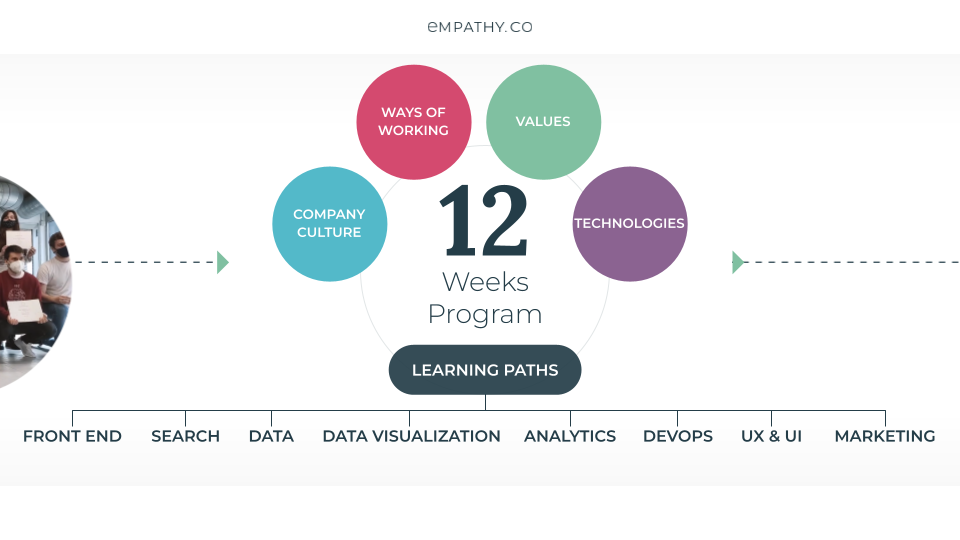

# Academy Diary on Board B12022
A blog to follow the progress of Empathy Academy

--------------------------------
# Context
## Empathy.co
[Empathy.co](https://empathy.co/) is the **leading innovator** in commerce *Search and Discovery*. With over 150 Developers and Search Engineers, it has headquarters in London (UK) and Asturias (ES). 

Committed to building human-centred commerce *Search and Discovery* platforms, [Empathy.co](https://empathy.co) gives big brands all they need to create trustworthy, understanding and joyful shopping experiences. 

Empathy.co believes that great technology can inspire brands to respect the individual, serve the community and thrive through these relationships.

**Trusted by global industry** leaders like Carrefour, Kroger and Inditex, Empathy is privately held with no external investors, is cash-flow positive and has seen sales grow by 124% in 2020. With this, Empathy.co is free to innovate and relentlessly pursue customer success.

--------------------------------
## Empathy Academy
[Academy](https://empathy.co/company/academy/) shows Empathy's commitment to academia and young talent. Its objective is to develop a long-lasting relationship between the industry and the learning community.

From challenges and seminars to internships, [Academy](https://empathy.co/company/academy/) looks to be involved in training and research efforts.

### Academy Paths Programme
This programme recruits young talent to train them in our technologies and practices, being a bridge between academia and the work world.

[Empathy.co](https://empathy.co/) summons three batches per year: Winter, Summer and Fall. Each **Bach** consists of a variety of learning **Paths** focused on one expertise. Lasting the programme for six months in two different phases.

#### 1st Phase

Through their fellowship in the programme, the **Academy Fellows** follow a three-month development process to acquire their proficiency with [Empathy.co](https://empathy.co/)'s guidance.

During this phase, the **Academy Fellows** develop some **Deployment Examples**, some of them individually, others in groups and the main one in a multidisciplinary manner across the different **Paths**.

#### 2nd Phase

Selected **Academy Fellows** develop their own project, designing, creating, and implementing their MVP in this phase.

----------------------------------------------------------

# This Batch!
Code name: B12022.
## Learning Paths & Participants

| Frontend Path | Backend Path  | Data Path     |
| ------------- | ------------- | ------------- |
| [Carmen Rendueles](https://github.com/carmen279) | [Alberto Díez](https://github.com/uo266536) | [Enrique Carnero](https://github.com/enriquerodez) |
| [Miguel Ligero](https://github.com/miguelliar) | [Daniel Barrientos](https://github.com/DaniBAIG7) | [Pablo Santurio](https://github.com/santurio928) |
|   | [Marcos Tobías](https://github.com/MarcosTobias)| [Rodrigo Álvarez](https://github.com/RodriAF) |

## Objective

Guided by [Empathy.co](https://empathy.co/)'s values, this batch aims to collaborate with [JaimeObregon/subvenciones](https://github.com/JaimeObregon/subvenciones) project.

1. Engage the dataset in our search engine, being fast, reliable and easy to use.
2. Create an amazing webpage.
3. Analyze, compare and build insights doing fancy "data magic".
4. Some nice to have optinal developments to keep the website relevant and the project alive.
5. Create awareness and motivate the community.

## Timetable
- [x] March 7th: **Batch Kick-off**
- [x] April 9th: **Blog starts**
- [x] April 11th: **Multidisciplinary project starts**
- [x] May 9th: **Preparation for the 2nd Phase project**
- [x] May 27th: **Live presentation of the project results**
- [ ] May 30th: **Fork [@JaimeObregon](https://twitter.com/jaimeobregon)'s repository**
- [ ] May 30th: **Agile rutine starts**
- [ ] June 3rd: **Project Gant chart**
- [ ] August 5th: **Live presentation**
