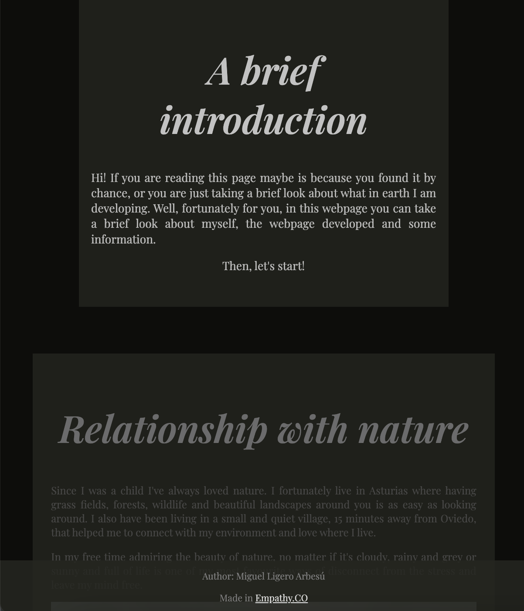
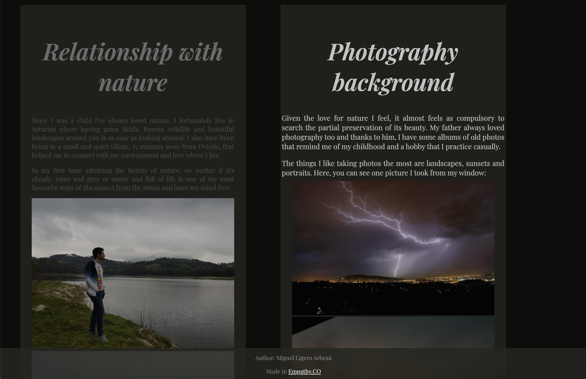
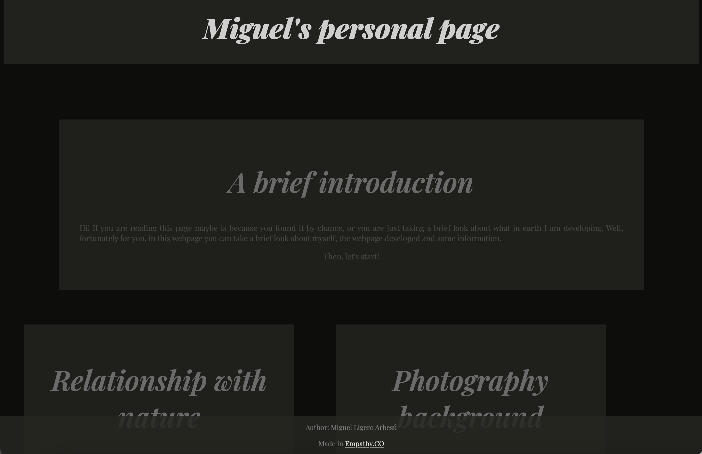
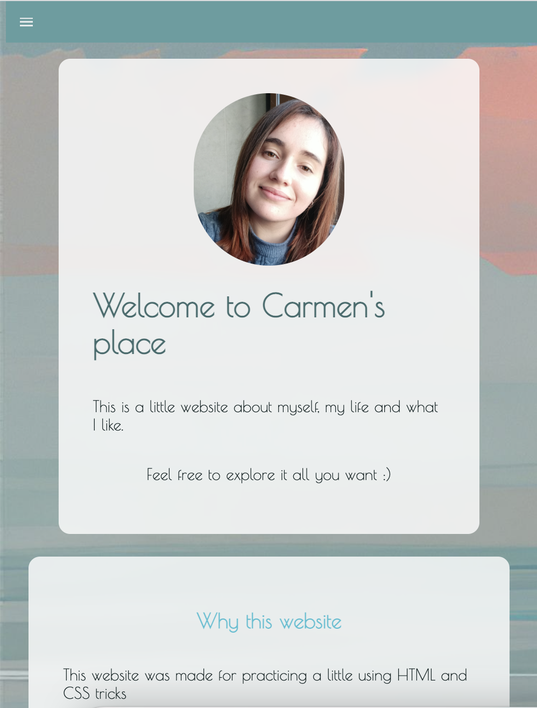
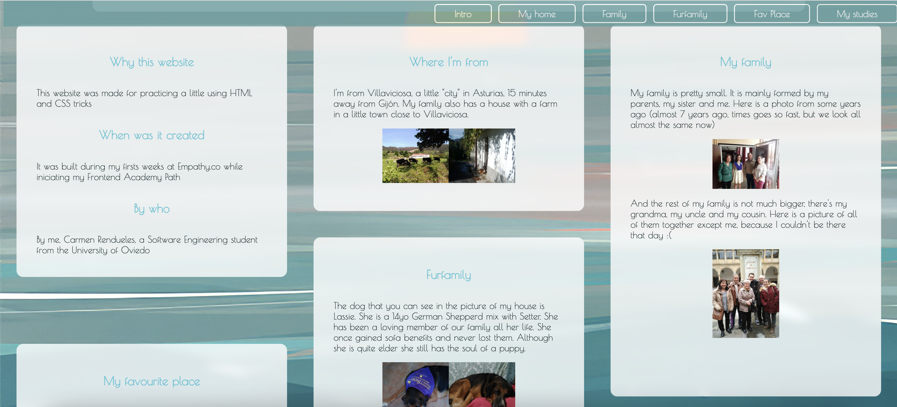
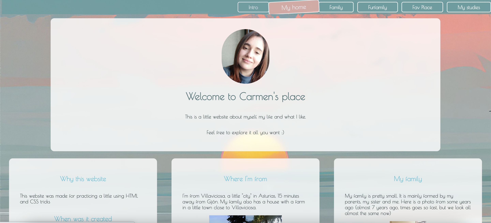

# Beginning from the basics (HTML + CSS) #
Our first week working was dedicated to the two fundamental pilars of web development: HTML and CSS.

## First steps ##
The first step was having a class with [Pedro Ondiviela](https://github.com/PedroOndh) who started from 0 on both.
## Practicing is key ##
The rest of the week, to practice, we both developed a personal webpage with plain and simple HTML and CSS. Tough a web nowadays is rarely implemented this way, its always a great practice in order to master these technologies.
The results of our webpages can be seen here:
[Carmen's webpage](https://carmen279.github.io/Carmens_experimental_website)
[Miguel's webpage](https://miguelliar.github.io/Miguel_experimental_website)
Some images of them:

